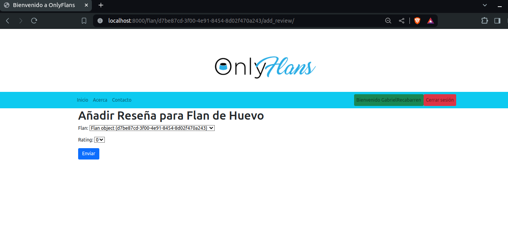
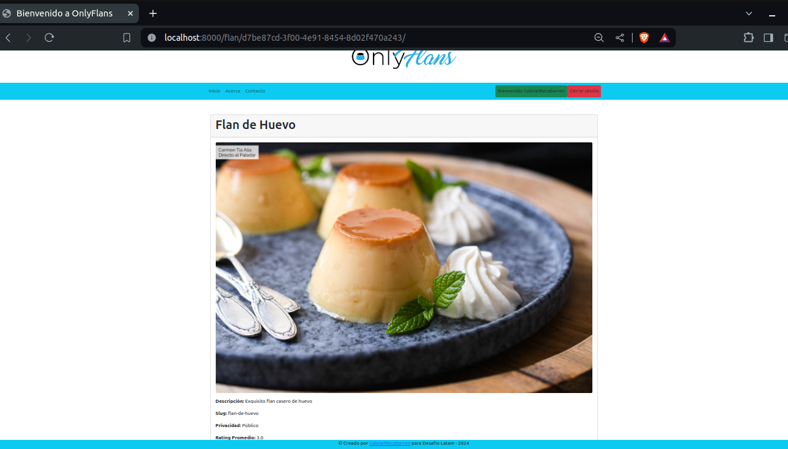
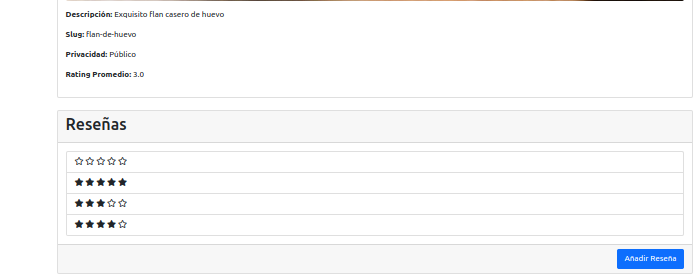

## OnlyFlans

### Descripción general del sitio web

OnlyFlans es una tienda en línea especializada en la venta de una variedad de flanes. Los usuarios pueden explorar la selección de flanes disponibles, ver detalles específicos de cada flan y dejar reseñas y calificaciones sobre su experiencia con el flan.

### Características base del sitio web

- Catálogo de flanes: Los usuarios pueden explorar una lista de flanes disponibles en la tienda.
- Detalles del flan: Los usuarios pueden ver detalles específicos de cada flan, como nombre, descripción y precio.

### Características personalizadas añadidas al sitio web

- Calificación con estrellas: Se ha agregado la capacidad para que los usuarios califiquen los flanes utilizando un sistema de calificación con estrellas. Esto permite a los usuarios expresar su opinión sobre la calidad de un flan en función de su experiencia.
  
- Página de detalles del flan: Se ha implementado una página de detalles avanzados del flan que muestra información detallada sobre un flan específico, incluyendo la visualización de reseñas y calificaciones de otros usuarios, así como el promedio de calificación.

### Problemas o dificultades con los que se encontraron a la hora de desarrollar el sitio web base

- Diseño y desarrollo de la estructura de la tienda en línea, incluyendo la navegación del catálogo de flanes y la visualización de detalles del flan.
- Implementación de Login incorporado en Django.

### Problemas o dificultades con los que se encontraron a la hora de añadir características personalizadas

- Integración del sistema de calificación con estrellas y su visualización en la página de detalles del flan.
- Diseño y desarrollo de la página de detalles del flan, renderizando desde el id del objeto, incluyendo la visualización de reseñas y calificaciones de otros usuarios, así como el cálculo del promedio de calificación.

### Imágenes
## Imágenes del Sitio Base

### Inicio

1. 

### Bienvenida Usuario

2. 

### Contacto

3. 

## Imagenes de Características Personalizadas
1. **Agregar Reseña**
   

2. **Nueva Vista de Detalles del Flan**
   

3. **Reseñas con Estrellas y Promedio de Valoración**
   

### Autor
## [GabrielRecabarren](https://github.com/GabrielRecabarren)
